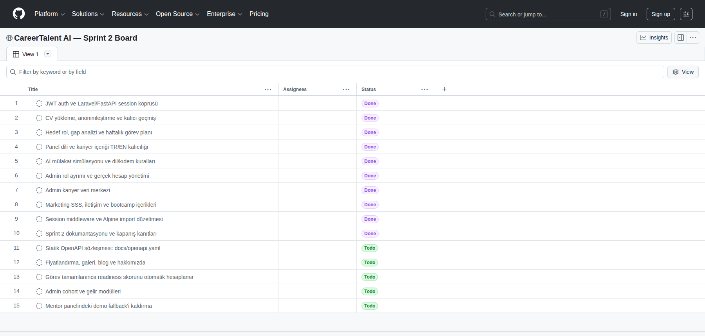

# CareerTalent AI

**YZTA Bootcamp 2026 | Grup 92**

Repo: https://github.com/busebatan/careertalent-ai

Önceki repo: https://github.com/donesakizz/TalentCareerAI

**Canlı ortam:**
- Tanıtım: https://careertalent.ygtlabs.ai/
- Panel: https://careertalent.ygtlabs.ai/panel

---

## 1. Ürün Fikri ve Roller

### Takım İsmi

**Grup 92** (YZTA Yapay Zeka ve Teknoloji Akademisi Bootcamp 2026)

### Takım Rolleri

| İsim | Rol | Sprint odak alanı |
|------|-----|-------------------|
| Buse Batan | Scrum Master + Frontend + Teknik Mimari | Laravel panel, mimari, sprint koordinasyonu |
| Bithanya Abraham Haile | Frontend + Sunum | Tanıtım sitesi, UI/UX, demo sunumu |
| Döne Sakız | Backend | FastAPI, API, veritabanı, Celery |
| Yiğit Dede | Veri & Analiz + Product Owner | CV parse, roller kataloğu, gap algoritması |

### Ürün İsmi

**CareerTalent AI** — Kariyer hazırlık işletim sistemi

### Ürün Açıklaması

YZTA bootcamp ve benzeri programlardan mezun olan veya mezun olmaya hazırlanan öğrenciler CV'lerini objektif okuyamıyor, ChatGPT ile tek seferlik metin alıyor ve "şimdi başvurabilirim" ile "eksikleri kapatınca ulaşırım" meslekleri karıştırıyor.

**CareerTalent AI**, PDF CV'yi analiz ederek ölçülebilir **readiness skoru**, **kariyer merdiveni (A/B/C)** ve **haftalık yol haritası** üretir. Kendi kurs sunmaz; eksik yetenekler için harici eğitim ve sertifika kaynaklarına yönlendirir.

**Pitch:** ChatGPT kariyer koçu verir; CareerTalent ölçülebilir hazırlık, kariyer merdiveni, haftalık plan ve pazar gerçekliği verir.

**Mimari karar (Sprint 2 kapanışı):** **Plan A** (FastAPI backend + Laravel frontend) devam ediyor. Auth köprüsü ve kariyer motoru çalıştığı için Plan B geçiş maliyeti gerekli görülmedi. Detay: [Teknik Mimari](docs/teknik-mimari.md#mimari-karar-ve-geçiş-planı).

### Ürün Özellikleri

| Özellik | Açıklama | Sprint / Faz | Durum (19 Tem) |
|---------|----------|--------------|---------------|
| Akıllı CV ayrıştırma | PDF → metin → AI profil çıkarımı | Sprint 1-2 | Auth, kuyruk/eager görev ve kalıcı geçmiş çalışıyor |
| Tanıtım sitesi | Marketing rotaları + i18n | Sprint 1-2 | 7 içerikli sayfa; 4 sayfa Sprint 3'e taşındı |
| Öğrenci paneli | `/panel/*` Layout A | Sprint 1-2 | Gerçek API; mentor yüzeyi demo fallback |
| Admin paneli | `/admin/*` readiness, öğrenci ve veri yönetimi | Sprint 2 | Gerçek çekirdek modüller; cohort/gelir eksik |
| CV oluşturucu | Harvard format, TR/EN şablon | Sprint 1-2 | Çalışıyor; analiz akışına bağlı |
| Kariyer merdiveni | A/B/C kişiye özel rol önerisi | Sprint 2 | CV'den dinamik 3–15 rol |
| Readiness skoru | Rol başına hazırlık yüzdesi | Sprint 2 | Panel ve API'de çalışıyor |
| SWOT | CV'den S/W, pazardan O/T | Sprint 2 | AI analiz çıktısında çalışıyor |
| Haftalık yol haritası | Gap → görev → skor güncelleme | Sprint 2 | Plan üretiliyor; tam skor otomasyonu eksik |
| Eğitim / sertifika önerisi | Ücretsiz/ücretli filtre, harici link | Sprint 2-3 | Dinamik eğitim araması |
| Yetenek pasaportu | Proje/GitHub/sertifika kanıtlarıyla skill proof | Sprint 2 | Evidence API'ye bağlı |
| AI mülakat simülasyonu | Teknik/HR/vaka sorusu + geri bildirim | Sprint 2 | Gerçek API, kıdem ve TR/EN seçimi |
| Başvuru takip CRM'i | Kaydedildi/başvuruldu/mülakat aşamaları | Sprint 2 | Gerçek engagement API |
| İş radarı ve gap uyarısı | Hedef role göre ilan sinyali ve eksik yetenek | Sprint 2 | Tek-ilan MVP |
| Mentor değerlendirme pazarı | CV/portfolio/mülakat review paketleri | Sprint 3 | Demo panel |
| İlan eşleştirme | Semantic uyum skoru | Faz 2 | Tek URL analizi çalışıyor |
| Kariyer sohbet ajanı | Bağlamlı LangChain asistan | Sprint 2 | Gerçek engagement API |
| Mentör / cohort paneli | Kim takıldı, hazırlık özeti | Sprint 3 | Planlı |

### Hedef Kitle

| Segment | İhtiyaç | CareerTalent karşılığı |
|---------|---------|-------------------------|
| **Birincil:** Bootcamp / YZTA öğrencileri | Mezuniyet sonrası hangi role hazırım, ne eksik? | Merdiven + gap + haftalık plan |
| **İkincil:** Kariyer değiştiren junior adaylar | CV'yi objektif okuma, süreklilik | Kalıcı panel, skor takibi |
| **B2B (vizyon):** Bootcamp / üniversite / kariyer merkezi | Cohort'ta kim geride kaldı? | Mentör dashboard (Sprint 3) |
| **Faz 2:** Aktif iş arayanlar | İlana uyum + eksik kapatma planı | İlan eşleştirme skoru |

### Product Backlog

Öncelik: **MoSCoW** (Must / Should / Could). Sprint ataması Product Owner (Yiğit) + SM (Buse) ile yapılır.

| ID | User Story | Öncelik | Sprint | Durum (19 Tem) |
|----|------------|---------|--------|---------------|
| US-01 | Öğrenci olarak kayıt olup giriş yapabilmeliyim | Must | 1→2 | Tamamlandı (FastAPI JWT + Laravel session) |
| US-02 | PDF CV yükleyebilmeliyim; iş kuyruğa alınmalı | Must | 1→2 | Tamamlandı (Celery + kalıcı CV kaydı) |
| US-03 | Tanıtım sitesinde ürünü görebilmeliyim | Must | 1→2 | Kısmen (7 içerikli, 4 placeholder sayfa) |
| US-04 | Panelde backend/API sağlık durumunu görebilmeliyim | Must | 1 | Tamamlandı |
| US-05 | CV'den yapılandırılmış profil çıkarılmalı | Must | 1–2 | Tamamlandı (AI kariyer analizi) |
| US-06 | CV'den sabit katalog sınırı olmadan kişiye özel kariyer rolleri önerilmeli | Must | 2 | Tamamlandı (3–15 dinamik A/B/C rolü) |
| US-07 | Seçtiğim meslek için gap + readiness % görmeliyim | Must | 2 | Tamamlandı (career engine) |
| US-08 | Haftalık yol haritası ve görevler oluşmalı | Must | 2 | Tamamlandı (`plan_target`) |
| US-09 | Eksik yetenek için filtrelenmiş eğitim linki görmeliyim | Should | 2 | Kısmen (dinamik eğitim araması) |
| US-10 | Görev tamamlanınca skor güncellenmeli | Should | 2 | Kısmen (kanıt sonrası yeniden analiz) |
| US-11 | Bağlamlı kariyer sohbeti kullanabilmeliyim | Could | 2 | Tamamlandı |
| US-12 | Mentör cohort özetini görebilmeliyim | Could | 3 | Planlı |
| US-13 | Gerçek iş ilanına uyum skoru alabilmeliyim | Could | Faz 2 | Tamamlandı (tek URL analizi) |
| US-14 | Yeteneklerimi kanıt linkleriyle pasaport halinde gösterebilmeliyim | Should | 2 | Tamamlandı (evidence API) |
| US-15 | Rol bazlı mülakat sorusu çözüp geri bildirim alabilmeliyim | Should | 2 | Tamamlandı (engagement API) |
| US-16 | Başvurularımı aşama bazlı takip edebilmeliyim | Should | 2 | Tamamlandı (applications API) |
| US-17 | Hedef rol ilanlarını uyum ve gap uyarısıyla görebilmeliyim | Should | 2 | Kısmen (tek-ilan MVP) |
| US-18 | Mentor review paketi seçip demo talep oluşturabilmeliyim | Could | 3 | Demo panel |
| US-19 | Admin olarak öğrenci, cohort, readiness ve gelir modüllerini yönetebilmeliyim | Should | 2 | Kısmen (gerçek öğrenci/readiness; cohort ve gelir eksik) |

**Backlog çalışma kuralı:** Sprint hedefi SM + PO tarafından tek cümleyle sabitlenir; işler **Must → Should → Could** sırasıyla, uzmanlık ve kabul kriterine göre atanır. Tamamlanmayan Should/Could maddeler sonraki sprint'e taşınır; taşınan Must maddelerin nedeni retrospektifte kaydedilir.

Sprint board: [CareerTalent AI — Sprint 2 Board](https://github.com/users/busebatan/projects/1)

Detaylı sprint görevleri: [Sprint 1](docs/sprintler/sprint-1-ilk-sprint.md) · [Sprint 2](docs/sprintler/sprint-2-ikinci-sprint.md) · [Sprint 3](docs/sprintler/sprint-3-son-sprint.md)

---

## Sprint 0 — Takım Kurulumu (12 Haziran 2026)

| Alan | Özet |
|------|------|
| **Hedef** | Takım, repo, iletişim, ilk mimari karar |
| **Ürün durumu** | Proje adı ve Plan A onaylandı |
| **Review** | CareerTalent AI fikri bootcamp brief ile uyumlu bulundu |
| **Retro** | 4 kişilik takımda frontend/backend ayrımı net; Plan B yedek olarak kayıtlı |

Detay: [sprint-0-takim-kurulumu.md](docs/sprintler/sprint-0-takim-kurulumu.md)

---

## Sprint 1 — İlk Sprint (19 Haziran – 5 Temmuz 2026)

**Sprint hedefi:** Öğrenci kayıt olup CV yükleyebilsin; backend parse işini kuyruğa alsın; tanıtım sitesi canlı görünsün.

### Daily Scrum Notları

| Tarih | Kim | Ne yapıldı? | Engel |
|-------|-----|-------------|-------|
| 19.06 | Tüm takım | Sprint kickoff, hedef ve görev dağılımı | — |
| 29.06 | Buse | Plan A repo yapısı (`backend/` + `frontend/`), mimari doküman | — |
| 29.06 | Bithanya | Marketing layout, ana sayfa, özellikler, nasıl çalışır | 6 alt sayfa henüz placeholder |
| 29.06 | Döne | FastAPI health, CV analyze endpoint, pytest | Auth ve Celery eksik |
| 29.06 | Yiğit | `data/roles` 5 meslek seed, career ladder servis testleri | — |
| 05.07 | Tüm takım | Sprint kapanış; README ve sprint raporu güncellendi | Auth + tam marketing içeriği Sprint 1 hedefinde kaldı |

### Sprint Board Updates

| Görev | Sorumlu | Durum | Not |
|-------|---------|-------|-----|
| FastAPI auth (JWT) | Döne | To Do | Router'da yok |
| CV upload + Celery iskelet | Döne | To Do | Senkron `/cv/analyze` var |
| `docs/openapi.yaml` v0 | Döne | To Do | Henüz oluşturulmadı |
| Marketing layout + rotalar | Bithanya | In Progress | 13 rota; 6'sı placeholder |
| Panel layout `/panel/*` | Buse | In Progress | Demo veri; auth middleware yok |
| `CareerTalentApiClient` | Buse | In Progress | Health + CV analyze bağlı |
| CV profil JSON şeması | Yiğit | In Progress | `extract_profile_from_text` çalışıyor |
| `data/roles` seed (5 meslek) | Yiğit | Done | `bootcamp_roles.json` |
| CV parse (pdf → Gemini) | Döne + Yiğit | Kısmen | `POST /api/v1/cv/analyze` senkron |

### Ürün Durumu (5 Temmuz 2026)

| Alan | Durum | Kanıt |
|------|-------|-------|
| Tanıtım sitesi | İskelet (kısmi içerik) | Layout + locale + 7 sayfa içerikli; 6 sayfa placeholder; auth demo |
| Panel iskeleti (`/panel/*`) | Kısmen | 12 rota; skor/merdiven `PanelDemoData` |
| FastAPI health | Tamamlandı | `GET /health`, `GET /health/ready` |
| CV analyze API | Kısmen | `POST /api/v1/cv/analyze`, `/analyze-text`; auth ve kuyruk yok |
| Auth (kayıt/giriş) | Devam | Marketing form UI; gerçek backend auth yok |
| Otomatik testler | Kısmen | 6 backend pytest dosyası; ~40 frontend PHPUnit testi |

**Kritik boşluk:** UI iskeleti güçlü; zeka katmanı panelde hâlâ büyük ölçüde demo. Sonraki sıçrama: CV → gerçek profil → skorların kalıcı profile bağlanması.

### Sprint Review (5 Temmuz)

**Gösterilebilen:**
- Canlı tanıtım: https://careertalent.ygtlabs.ai/
- Canlı panel: https://careertalent.ygtlabs.ai/panel
- Tanıtım iskeleti: ana sayfa, özellikler, nasıl çalışır, bootcamp, meslek sihirbazı
- Panel: kariyer merdiveni, CV oluştur, ilan eşleştirme (demo)
- API health ve CV analyze (senkron, auth'suz demo)

**Gösterilemeyen / eksik:**
- Kayıt/giriş uçtan uca
- PDF yükleme → Celery kuyruk → kalıcı profil
- Fiyatlandırma, SSS, iletişim vb. placeholder sayfaların gerçek içeriği

### Sprint Retrospective (5 Temmuz)

| İyi gitti | İyileştirilecek | Aksiyon |
|-----------|-----------------|---------|
| Plan A repo yapısı ve dokümantasyon disiplini | İki stack koordinasyonu (Laravel ↔ FastAPI) | OpenAPI v0 Sprint 2 başında tamamlanacak |
| Marketing + panel UI hızlı ilerledi | Tanıtım "tamamlandı" algısı; 6 sayfa boş | Sprint 2'ye taşınan içerik backlog'u |
| Test altyapısı kuruldu | Skorlar demo; güven riski | Sprint 2'de gerçek parse → skor bağlantısı |
| CV analyze API erken geldi | Auth ve kuyruk Sprint 1 hedefinde kaldı | Sprint 2 Must: JWT + kalıcı CV kaydı |

**Mimari retro (Plan A / Plan B):**

| Tetikleyici | Evet/Hayır | Not |
|-------------|------------|-----|
| Çift auth blokajı | Hayır | Henüz auth implementasyonu yok |
| API uyumsuzluğu | Kısmen | `openapi.yaml` v0 eksik |
| Upload proxy sorunu | Hayır | Panel → API analyze çalışıyor |
| Demo baskısı | Evet | Panel zengin; backend auth/kuyruk geride |

**Karar:** Plan A devam (Sprint 2 başında Plan B checklist tekrar değerlendirilecek)

Detay: [sprint-1-ilk-sprint.md](docs/sprintler/sprint-1-ilk-sprint.md)

---

## Sprint 2 — İkinci Sprint (6 Temmuz – 19 Temmuz 2026) — Tamamlandı

**Sprint hedefi:** Öğrenci hedef mesleğini seçsin; eksik yetenekler ve haftalık yol haritasını görsün; hazırlık yüzdesi panelde görünsün.

Bu Sprint 2 raporu; **Backlog Dağıtma Mantığı**, **Daily Scrum Notları**, **Sprint Board Updates**, **Ürün Durumu**, **Sprint Review** ve **Sprint Retrospective** başlıklarını doğrudan izler. README denetim özetini, [ayrıntılı Sprint 2 dosyası](docs/sprintler/sprint-2-ikinci-sprint.md) kararları ve kanıtları tutar.

### Backlog Dağıtma Mantığı

Sprint 1'den devreden auth ve CV analiz kuyruğu **Must** olarak önce kapatıldı. Ardından CV→kişiye özel rol→hedef→görev planı zinciri, kullanıcı dili, admin yetki ayrımı ve gerçek veri modülleri önceliklendirildi. Livewire zorunlu görülmedi; Blade mimarisi korundu. OpenAPI, dört marketing sayfası, cohort/gelir ve tam görev→skor otomasyonu Sprint 3'e taşındı.

### Daily Scrum Notları

6–19 Temmuz kayıtları; auth, CV/Celery, dinamik kariyer motoru, admin veri merkezi, drag-drop, TR/EN kalıcılığı, CV anonimleştirme, AI mülakat, PR #9–#11 ve final test/build kapanışını kapsıyor. Ayrıntı: [Sprint 2 Daily Scrum](docs/sprintler/sprint-2-ikinci-sprint.md#daily-scrum-notları).

### Sprint Board Updates

- **Done:** Auth/session, CV upload ve geçmiş, dinamik career engine, hedef planı, locale kalıcılığı, AI mülakat, CV anonimleştirme, gerçek admin modülleri, kariyer veri merkezi, SSS/iletişim/bootcamp ve middleware/Alpine düzeltmesi.
- **Sprint 3'e taşındı:** `docs/openapi.yaml`, fiyatlandırma/galeri/blog/hakkımızda, tam görev→skor otomasyonu, admin cohort/gelir ve mentor demo fallback.
- **PR kanıtı:** Sprint 2'de PR #2–#11 merge edildi; kapanışta **11 closed / 0 open PR**.
- **Güncel board:** 19 Temmuz kapanışında GitHub Project üzerinde **10 Done / 5 Todo** kart doğrulandı. Kickoff ve orta nokta görüntüleri bulunmadığı için geçmiş ekran üretilmedi.

[Canlı GitHub Project board](https://github.com/users/busebatan/projects/1)



### Ürün Durumu (19 Temmuz kapanış)

| Alan | Durum |
|------|-------|
| Öğrenci paneli | CV yükleme/oluşturma, analiz, kişiye özel rota, görev, kanıt, başvuru ve mülakat akışları gerçek API'ye bağlı |
| Kariyer analizi | Sabit beş meslek sınırı yok; geçerli analizden 3–15 kişiye özel A/B/C rolü |
| Dil | Panel tercihi kullanıcı hesabında saklanır; kariyer içeriği panel diline döner |
| Admin | Ayrı admin login, rol kontrolü, hesap yönetimi ve gerçek veri modülleri |
| Marketing | SSS, iletişim ve bootcamp tamamlandı; dört sayfa Sprint 3'e taşındı |
| Test/build | Backend **100/100**, frontend PHP **164/164**, frontend JS **37/37**, Vite build başarılı |

19 Temmuz canlı ana sayfa, panel/admin login, yetkili gerçek admin dashboard/readiness/veri merkezi/hesap yönetimi ve PR akışı görselleri Sprint 2 raporuna eklendi. Admin kayıtlarındaki kişisel alanlar public görselde maskelendi. PR #9–#11 dahil 11 PR'ın tamamı `main` içinde doğrulandı ve canlıya deploy edildi; SSS, iletişim, özellikler, nasıl çalışır, bootcamp ve yeni görsel assetler HTTPS/browser readback ile doğrulandı.

### Sprint Review

Sprint hedefinin çekirdek akışı tamamlandı: CV analizi kişiye özel rol, gap, hedef ve haftalık plana dönüşüyor; panel dili ve admin yetki sınırı kalıcı hale geldi. Merge sonrası SSS testi ve bozuk `composer test` komutu düzeltildi. Statik OpenAPI, dört marketing sayfası, cohort/gelir ve tam skor otomasyonu yetişmedi; Sprint 3 backlog'una aktarıldı.

### Sprint Retrospective

Gerçek CV→rol→plan akışının çalışması ekipte başarı ve motivasyon hissini güçlendirdi. Son günlerde test, deploy ve dokümantasyonun aynı anda kapanması baskı ve yorgunluk yarattı; PR üzerinden hızlı yardımlaşma güven verdi. İki servisli Plan A devam ediyor.

**Sprint 3 süreç aksiyonları:** (1) Buse, kickoff/orta nokta/kapanış board görüntülerini aynı gün rapora ekleyecek. (2) Takım, Daily sonunda kısa duygu/engel kontrolü yapacak; doküman ve kanıt işleri son güne bırakılmayacak.

### Her Sprint Sonunda Beklentiler

- [x] Backlog Dağıtma Mantığı
- [x] Daily Scrum Notları
- [x] Sprint Board Updates ve güncel GitHub Project görseli
- [x] Ürün Durumu ve final görselleri
- [x] Sprint Review
- [x] Sprint Retrospective ve sahipli Sprint 3 aksiyonları
- [x] Sprint 1 tarihsel kaydı değiştirilmedi

Detay ve görsel kanıtlar: [sprint-2-ikinci-sprint.md](docs/sprintler/sprint-2-ikinci-sprint.md)

---

## Sprint 3 — Son Sprint (20 Temmuz – 2 Ağustos 2026) — Planlı

**Sprint hedefi:** Bağlamlı sohbet, mentör paneli, jüri demo senaryosu.

Detay: [sprint-3-son-sprint.md](docs/sprintler/sprint-3-son-sprint.md)

---

## Geliştirici Notları

### Teknoloji Yığını

| Katman | Klasör | Teknoloji |
|--------|--------|-----------|
| Frontend (UI) | `frontend/` | Laravel 13, Blade, Livewire, Tailwind |
| Backend (API) | `backend/` | FastAPI, SQLAlchemy, Celery |
| Yapay zeka | `backend/` | LangChain, Gemini API |
| ML / benzerlik | `backend/` | NumPy, Scikit-learn (cosine similarity) |
| Veritabanı | `backend/` | PostgreSQL (+ Redis kuyruk) |
| Oturum (UI) | `frontend/` | SQLite (yalnızca session/cache) |

### Mimari

| Katman | Port |
|--------|------|
| FastAPI API | `:8000` |
| Laravel web | `:8080` |

Laravel tanıtım sitesi ve öğrenci panelini sunar. İş mantığı, veritabanı ve yapay zeka **FastAPI** tarafındadır.

### Canlı ortam (demo)

| Yüzey | URL |
|-------|-----|
| Tanıtım (landing) | https://careertalent.ygtlabs.ai/ |
| Öğrenci paneli | https://careertalent.ygtlabs.ai/panel |

### Kurulum (lokal)

```bash
git clone https://github.com/busebatan/careertalent-ai.git
cd careertalent-ai
```

**Backend:**

```bash
cd backend
python -m venv .venv && source .venv/bin/activate
pip install -r requirements.txt
cp .env.example .env
# backend/.env içine GEMINI_API_KEY=... ekleyin
uvicorn app.main:app --reload --port 8000
```

Sağlık kontrolü: http://localhost:8000/health

**Frontend:**

```bash
cd frontend
cp .env.example .env
composer install
php artisan key:generate
touch database/database.sqlite
php artisan migrate
npm install && npm run build
php artisan serve --port=8080
```

- Tanıtım (lokal): http://localhost:8080
- Panel (lokal): http://localhost:8080/panel

`frontend/.env` içinde `CAREERTALENT_API_URL=http://localhost:8000` olmalı.

**Docker (opsiyonel):**

```bash
cp .env.example .env
docker compose up
```

### Dokümantasyon

- [Bootcamp Takvimi](docs/bootcamp-takvimi.md)
- [Sprint Raporları](docs/sprintler/README.md)
- [B2B Teknik İşe Alım Planı v004](docs/urun/2026-07-19-v004-b2b-teknik-ise-alim-plani.md)
- [Ürün Değeri Sürüm İndeksi](docs/urun/README.md)
- [Teknik Mimari](docs/teknik-mimari.md)

### Eski Stack

İlk Streamlit MVP ve eski Laravel monolith denemesi `archive/` klasöründe referans olarak duruyor.

---

*Son güncelleme: 5 Temmuz 2026 | Grup 92 — CareerTalent AI*
