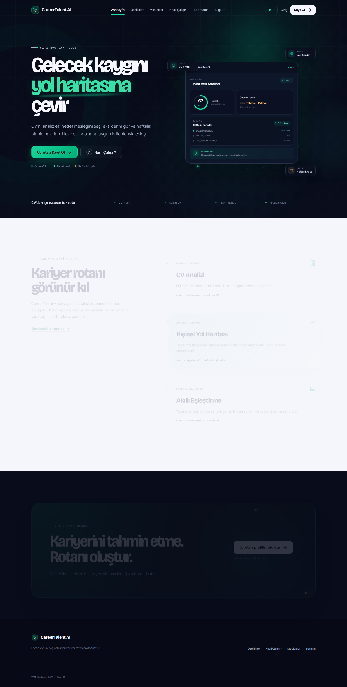
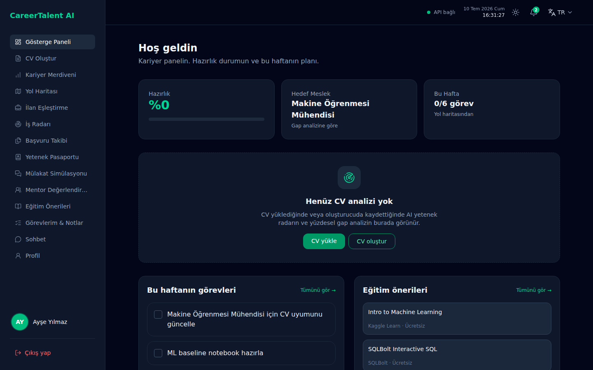
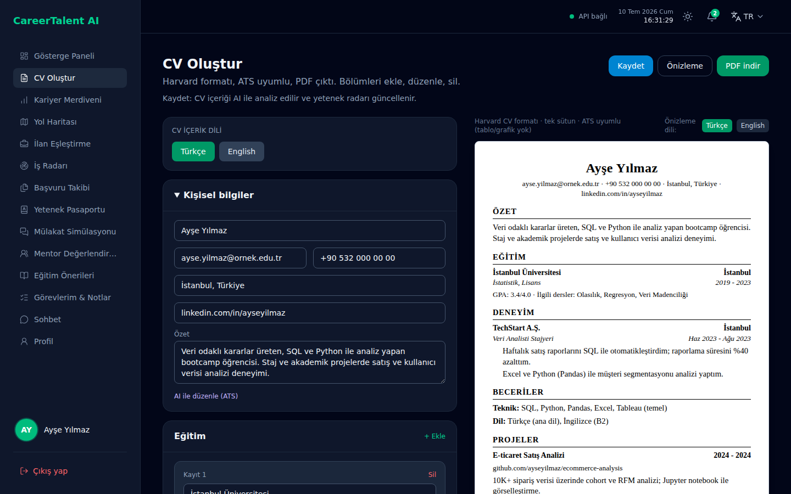

# Sprint 1 — İlk Sprint

| | |
|---|---|
| **Tarih** | 19 Haziran – 5 Temmuz 2026 |
| **Süre** | ~17 gün |
| **Hedef** | Çalışan iskelet: auth, CV yükleme başlangıcı, tanıtım sitesi, API sözleşmesi v0 |
| **Mimari** | Plan A (FastAPI + Laravel) |
| **Durum** | Kapanış (5 Temmuz 2026) |

---

## Plan (sabit)

### Sprint hedefi (tek cümle)

Öğrenci kayıt olup CV yükleyebilsin; backend parse işini kuyruğa alsın; tanıtım sitesi canlı görünsün.

### Backlog dağıtma mantığı (bu sprint)

| Kural | Uygulama |
|-------|----------|
| Must önce | Auth, CV upload, health, tanıtım çekirdeği |
| Uzmanlık | Backend: Döne · Frontend: Buse/Bithanya · Veri: Yiğit |
| Kanıt | Her görevde test, route veya API yanıtı |
| Taşıma | Must tamamlanmazsa Sprint 2'ye taşınır ve retro'da gerekçe yazılır |

### Görev dağılımı

| Görev | Sorumlu | Bitti mi? | Kanıt / not |
|-------|---------|-----------|-------------|
| FastAPI auth (register/login JWT) | Döne | ☐ | Router'da auth modülü yok |
| DB migration (users, cohorts, cv_documents) | Döne | ☐ | `init_db` iskelet; tam migration yok |
| CV upload endpoint + Celery task iskeleti | Döne | ☐ | `POST /api/v1/cv/analyze` senkron var; Celery yok |
| `docs/openapi.yaml` v0 (auth + cv) | Döne | ☐ | Dosya henüz oluşturulmadı |
| Panel layout A + routing (`/panel/*`) | Buse | ☑ kısmen | 12 panel rotası; auth middleware yok |
| `CareerTalentApiClient` (health, login, upload) | Buse | ☑ kısmen | Health + CV analyze; login/upload eksik |
| Tanıtım: layout + rotalar + çekirdek sayfalar | Bithanya | ☑ kısmen | İskelet hazır; 6 sayfa placeholder |
| CV profil JSON şeması | Yiğit | ☑ kısmen | `cv_profile.py`, `schemas/cv.py` |
| `data/roles` seed (5 meslek) | Yiğit | ☑ | `data/roles/bootcamp_roles.json` |
| CV parse mantığı (pdf → metin → Gemini) | Döne + Yiğit | ☑ kısmen | `cv_parser.py`, `extract_profile_from_text` |
| Marketing + panel otomatik testler | Buse + Bithanya | ☑ kısmen | `MarketingPagesTest`, panel feature testleri |
| Career ladder servisi | Yiğit | ☑ | `career_ladder_service.py` + pytest |

### Tanıtım sitesi sayfa envanteri (5 Temmuz)

| Rota | Sayfa | Durum | Açıklama |
|------|-------|-------|----------|
| `/` | Ana sayfa | İçerik var | Hero, özellik kartları, panel önizlemesi |
| `/ozellikler` | Özellikler | İçerik var | 4 madde + «yakında» ilan eşleştirme |
| `/nasil-calisir` | Nasıl çalışır | İçerik var | 4 adımlı akış |
| `/bootcamp` | Bootcamp | İçerik var | Kısa tanıtım + CTA |
| `/meslekler` | Meslek sihirbazı | İnteraktif iskelet | 4 adımlı wizard; sonuçlar statik/demo |
| `/giris`, `/kayit` | Auth formları | UI iskelet | Gerçek auth yok; demo panele link |
| `/fiyatlandirma` | Fiyatlandırma | Placeholder | «İçerik yakında eklenecek» |
| `/galeri` | Galeri | Placeholder | «İçerik yakında eklenecek» |
| `/faq` | SSS | Placeholder | «İçerik yakında eklenecek» |
| `/hakkimizda` | Hakkımızda | Placeholder | «İçerik yakında eklenecek» |
| `/iletisim` | İletişim | Placeholder | «İçerik yakında eklenecek» |
| `/blog` | Blog | Placeholder | «İçerik yakında eklenecek» |

**Sonuç:** Tanıtım sitesi **tamamlanmış değil**; routing/layout ve çekirdek sayfalar hazır, 6 alt sayfa ve gerçek auth Sprint 1 hedefinde kaldı.

### Panel envanteri (5 Temmuz)

| Rota | Özellik | Veri kaynağı |
|------|---------|--------------|
| `/panel` | Dashboard | `PanelDemoData` + session CV analizi |
| `/panel/profil` | Profil | Demo |
| `/panel/kariyer-merdiveni` | Kariyer merdiveni | Demo veya son analiz session |
| `/panel/cv-olustur` | CV builder | Gerçek form; API'ye metin gönderimi |
| `/panel/yol-haritasi` | Yol haritası | Demo |
| `/panel/egitim-onerileri` | Eğitim önerileri | Demo seed |
| `/panel/ilan-eslestirme` | İlan eşleştirme | Demo analiz |
| `/panel/gorevlerim` | Görevler | localStorage demo |
| `/panel/sohbet` | Sohbet | «Yakında» |

### Backend API envanteri (5 Temmuz)

| Endpoint | Durum | Not |
|----------|-------|-----|
| `GET /health` | Tamamlandı | pytest yeşil |
| `GET /health/ready` | Tamamlandı | DB + AI config kontrolü |
| `POST /api/v1/cv/analyze` | Kısmen | PDF upload, senkron; auth yok |
| `POST /api/v1/cv/analyze-text` | Kısmen | Builder metni; auth yok |
| `POST /api/v1/auth/*` | Yok | Sprint 1 hedefi, tamamlanmadı |

### Kabul kriterleri (Definition of Done)

- [x] `GET /health` çalışıyor
- [ ] `POST /api/v1/auth/login` çalışıyor
- [x] Laravel panel backend durumunu gösteriyor (health / analyze bağlantısı)
- [ ] PDF yükleme FastAPI'ye ulaşıyor, job `pending` → `processing` dönüyor (senkron analyze var, kuyruk yok)
- [x] Tanıtım `/` ve `/ozellikler` 200 dönüyor (içerik kısmi; 6 sayfa placeholder)
- [x] En az 1 backend pytest + 1 frontend PHPUnit yeşil (6 backend + ~40 frontend test dosyası/testi)

### Mimari retro (5 Temmuz — sprint kapanışı)

> **Plan B geçişi?** Sprint 1 sonunda [teknik-mimari.md](../teknik-mimari.md#mimari-karar-ve-geçiş-planı) tetikleyici checklist'i doldur.

| Tetikleyici | Evet/Hayır | Not |
|-------------|------------|-----|
| Çift auth blokajı | Hayır | Auth henüz yok; blokaj oluşmadı |
| API uyumsuzluğu | Kısmen | `openapi.yaml` v0 eksik; panel ↔ API elle eşleştirildi |
| Upload proxy sorunu | Hayır | `CvUploadController` → FastAPI çalışıyor |
| Demo baskısı | Evet | Panel zengin demo; auth/kuyruk geride kaldı |

**Karar:** ☑ Plan A devam ☐ Plan B değerlendir ☐ Ertele

**Gerekçe:** İki stack ayrımı işe yarıyor; geçiş maliyeti şu an gereksiz. Sprint 2'de auth + openapi v0 öncelik.

---

## Günlük notlar (Daily Scrum)

| Tarih | Kim | Ne yapıldı? | Engel / not |
|-------|-----|-------------|-------------|
| 19.06 | Tüm takım | Sprint kickoff; hedef, rol ve görev dağılımı onaylandı | — |
| 29.06 | Buse | `backend/` + `frontend/` Plan A yapısı; `docs/teknik-mimari.md` güncellendi | — |
| 29.06 | Bithanya | Marketing layout, header, locale; ana sayfa ve özellikler sayfaları | Alt sayfalar placeholder bırakıldı |
| 29.06 | Döne | FastAPI `main.py`, health endpoint, CORS, CV router iskeleti | Auth ve Celery sprint sonuna kaldı |
| 29.06 | Yiğit | `bootcamp_roles.json` (5 rol); `career_ladder_service` + unit testler | — |
| 29.06 | Buse | Panel rotaları (`web.php`); `PanelDemoData`; marketing testleri | Auth middleware bekliyor |
| — | — | _(Ara günler: daily notları takıma bırakıldı)_ | Sprint 2'den itibaren günlük doldurulacak |
| 05.07 | Tüm takım | Sprint 1 kapanış; README ve bu dosya güncellendi; retro yapıldı | Auth, openapi, marketing içerik Sprint 2'ye taşındı |

---

## Sprint Board Updates (5 Temmuz özeti)

| Kolon | Öğe sayısı | Örnekler |
|-------|------------|----------|
| **Done** | 4 | Health API, roles seed, career ladder servisi, marketing route testleri |
| **In Progress** | 5 | Panel layout, ApiClient, CV parse, marketing içerik, profil şeması |
| **To Do** | 4 | JWT auth, DB migration, Celery, openapi v0 |

GitHub board: https://github.com/busebatan/careertalent-ai/issues

---

## Sprint sonu raporu

> **Teslim tarihi:** 5 Temmuz 2026  
> Şablon: [sprint-rapor-sablonu.md](sprint-rapor-sablonu.md)

### Özet (3–5 cümle)

Sprint 1'de Plan A mimarisi kuruldu: FastAPI backend ve Laravel frontend ayrı repoda çalışır durumda. Tanıtım sitesi **iskelet + kısmi içerik** seviyesinde; panel UI zengin ancak verilerin çoğu demo. CV analyze API senkron olarak çalışıyor; auth, Celery kuyruk ve OpenAPI sözleşmesi Sprint 1 hedefinde tamamlanamadı. Demo gösterilebilir (marketing çekirdeği + panel + health/analyze); uçtan uca kayıt → kalıcı profil akışı henüz yok.

### Tamamlanan işler

| Görev | Sorumlu | Kanıt |
|-------|---------|-------|
| Plan A repo yapısı | Buse | `backend/`, `frontend/`, `docs/teknik-mimari.md` |
| FastAPI health + ready | Döne | `backend/tests/test_health.py`, `/health` |
| CV analyze (senkron) | Döne + Yiğit | `backend/app/api/v1/cv.py`, `test_cv_analyze.py` |
| Career ladder servisi | Yiğit | `career_ladder_service.py`, `test_career_ladder_service.py` |
| 5 meslek seed | Yiğit | `data/roles/bootcamp_roles.json` |
| Marketing layout + 7 içerik sayfası | Bithanya | `frontend/resources/views/marketing/`, `MarketingPagesTest` |
| Panel 12 rota + demo veri | Buse | `frontend/routes/web.php`, `PanelDemoData` |
| CV builder + analyze bağlantısı | Buse | `CvBuilderAnalyzeTest`, `CvUploadController` |
| Bootcamp dokümantasyonu | Buse | `docs/bootcamp-takvimi.md`, sprint dosyaları |

### Tamamlanmayan / ertelenen

| Görev | Sebep | Sonraki sprint |
|-------|-------|----------------|
| JWT auth (register/login) | Öncelik UI iskeletine kaydı | Sprint 2 Must |
| Celery CV kuyruk | Senkron analyze ile demo yeterli görüldü | Sprint 2 Should |
| `docs/openapi.yaml` v0 | Zaman; panel elle entegre edildi | Sprint 2 Must (hafta 1) |
| Marketing 6 placeholder sayfa | İçerik üretimi ertelendi | Sprint 2 Should |
| DB migration (users, cv_documents) | Auth'a bağlı | Sprint 2 Must |

### Demo durumu (5 Temmuz)

| Akış | Çalışıyor mu? | Not |
|------|---------------|-----|
| Tanıtım sitesi | Kısmen | Çekirdek sayfalar evet; 6 sayfa placeholder |
| Kayıt / giriş | Hayır | Form UI var; backend auth yok |
| CV yükleme | Kısmen | Panel → API senkron analyze; kalıcı kayıt yok |
| Kariyer seçimi | Kısmen | Panel demo + API ladder iskeleti |
| Yol haritası | Kısmen | Demo veri |
| Sohbet | Hayır | «Yakında» |

### Ürün durumu özeti

| Katman | Tamamlanma (tahmini) | Açıklama |
|--------|----------------------|----------|
| Marketing UI | ~55% | Layout + çekirdek sayfalar; placeholder ve auth eksik |
| Panel UI | ~70% | Rotalar ve demo zengin; gerçek veri bağlantısı zayıf |
| Backend API | ~40% | Health + CV analyze; auth, kuyruk, openapi yok |
| Veri / roller | ~60% | Seed + ladder algoritması; gap/roadmap API yok |
| Test | ~50% | Smoke ve unit testler var; entegrasyon/auth testi yok |

### Riskler ve engeller

1. Panel demo zenginliği «ürün bitti» algısı yaratabilir; jüriye demo vs gerçek ayrımı net anlatılmalı.
2. Auth gecikmesi Sprint 2'nin tüm kullanıcı hikayelerini bloke edebilir; hafta 1 önceliği olmalı.

### Sonraki sprint önceliği (max 3)

1. **JWT auth** + Laravel Breeze/middleware + kalıcı kullanıcı/CV kaydı
2. **OpenAPI v0** + gap/readiness API (demo skorları gerçek profile bağlama)
3. Marketing placeholder sayfalarından en az **SSS + fiyatlandırma + iletişim** içeriği

### Mimari karar (Sprint 1 retro)

- **Plan A / Plan B kararı:** Plan A devam
- **Gerekçe:** Upload proxy ve health sorunsuz; auth henüz implement edilmediği için Plan B tetikleyicileri aktifleşmedi. Sprint 2 sonunda checklist tekrar değerlendirilecek.

### Ekran görüntüsü / video

- Demo URL (canlı): https://careertalent.ygtlabs.ai/ · https://careertalent.ygtlabs.ai/panel
- Demo URL (lokal): http://localhost:8080 · http://localhost:8080/panel
- Video linki (varsa): _
- Ekran görüntüleri (10 Temmuz 2026): `screenshots/sprint-1/` (aşağıdaki bölüm)

---

## Ürün durumu görselleri (Sprint 1 teslimi)

> Mentor geri bildirimi: Sprint 1 tablosu ve backlog değiştirilmedi; canlı ürün ekranları eklendi. `/admin` Sprint 2 kapsamında.

**Tanıtım sitesi** — https://careertalent.ygtlabs.ai/

**Öğrenci paneli** — https://careertalent.ygtlabs.ai/panel

| Ekran | URL | Sprint |
|-------|-----|--------|
| Ana sayfa | `/` | Sprint 1 |
| Özellikler | `/ozellikler` | Sprint 1 |
| Panel dashboard | `/panel` | Sprint 1 |
| CV oluştur | `/panel/cv-olustur` | Sprint 1 |
| Admin paneli | `/admin` | Sprint 2 (planlandı) |

---

*Raporu hazırlayan: Grup 92*  
*Tarih: 5 Temmuz 2026*

*Durum: Kapanış (19 Haz – 5 Tem 2026)*
