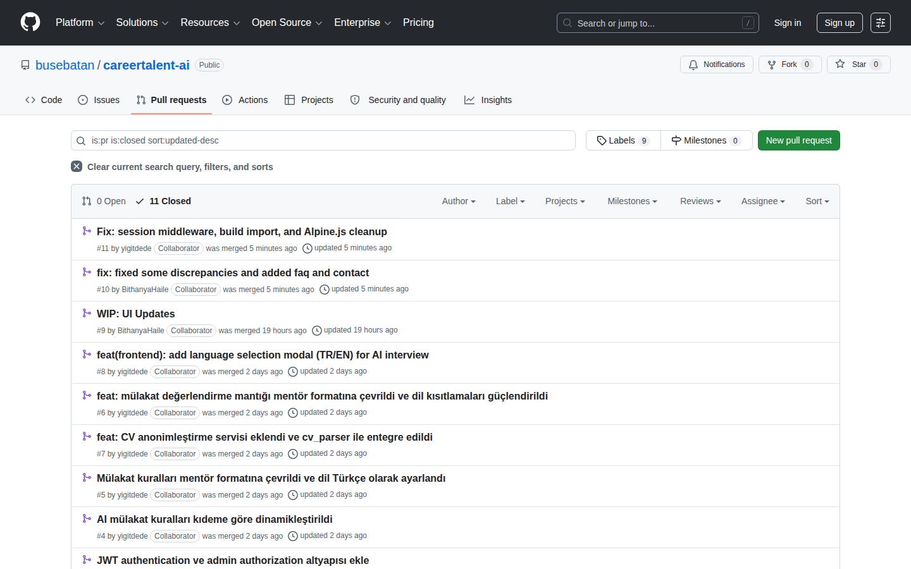
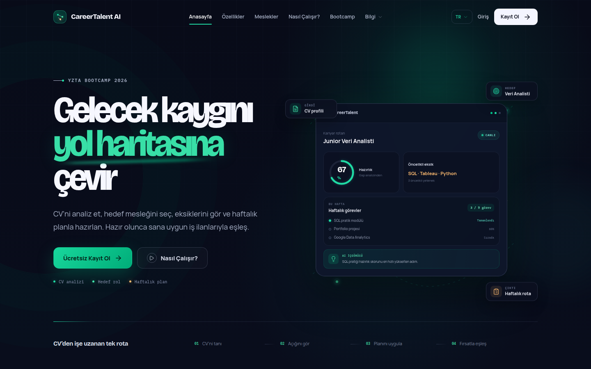
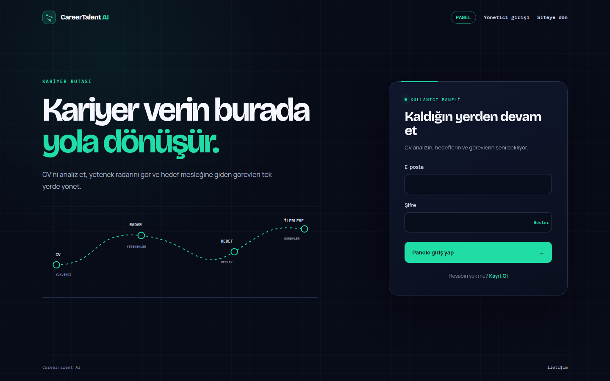
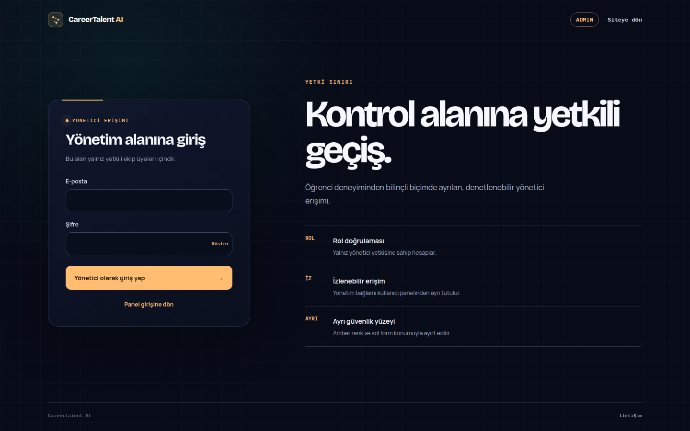
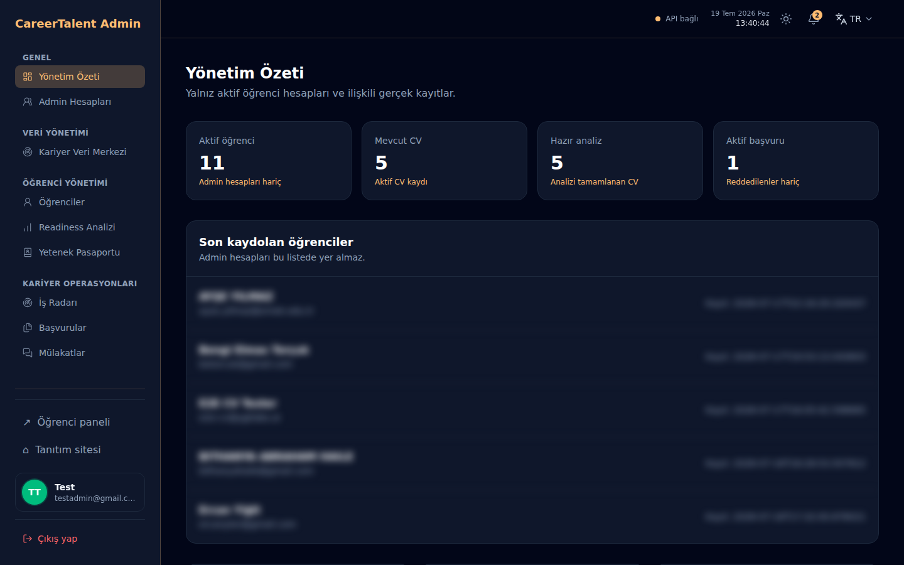
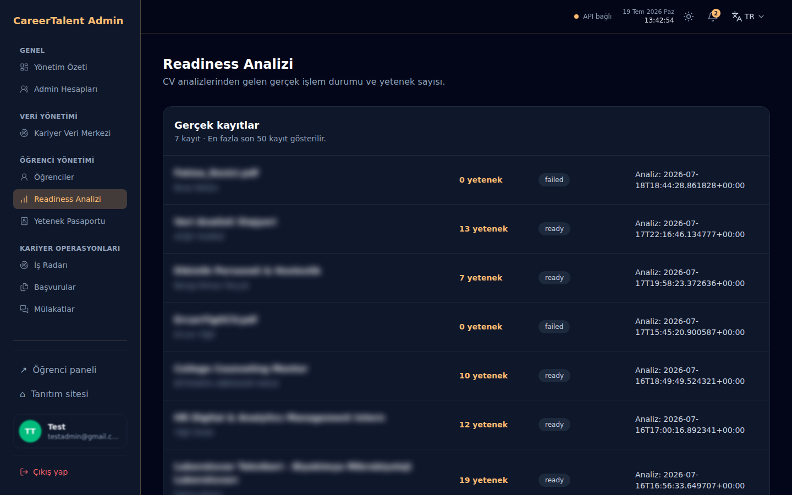
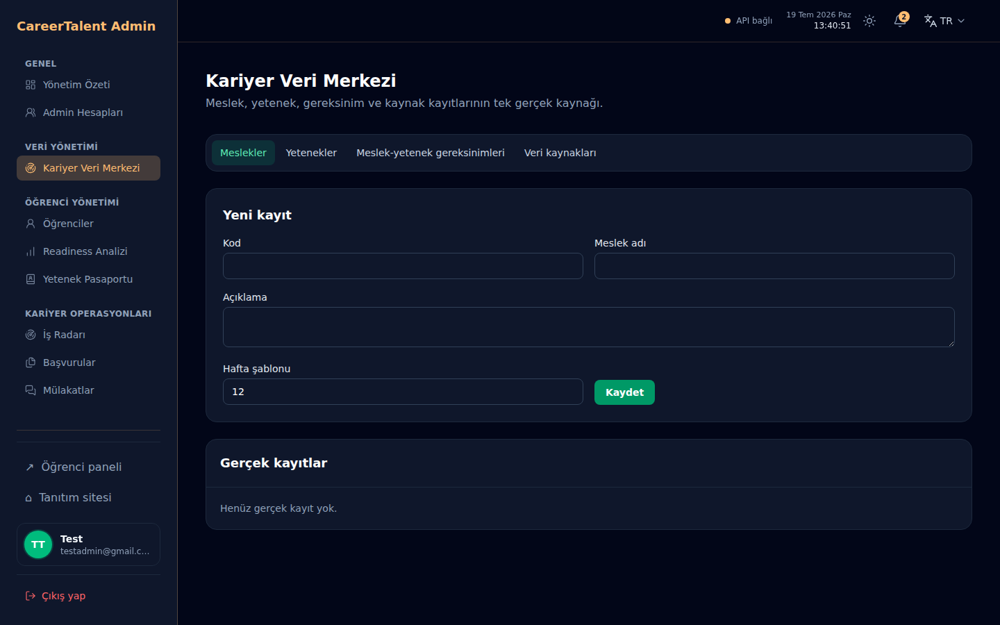
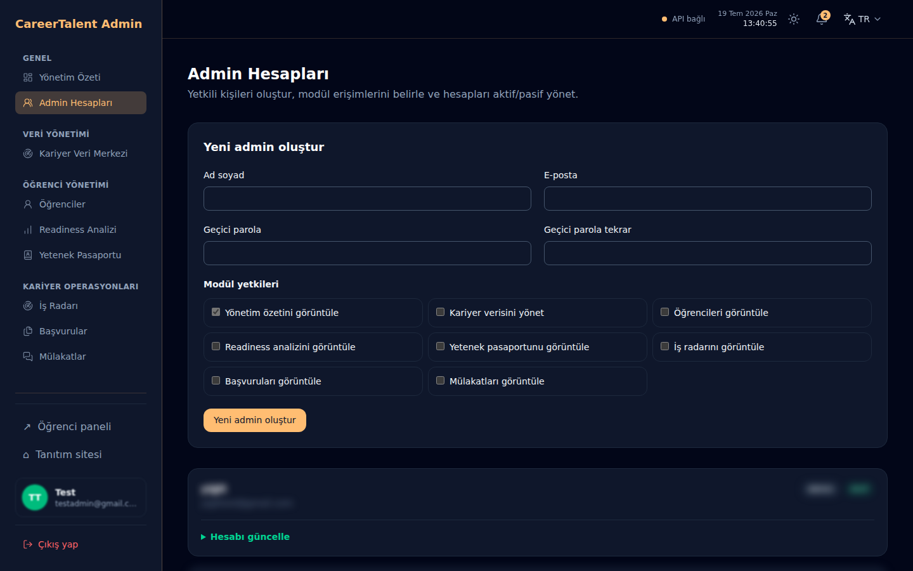

# Sprint 2 — İkinci Sprint

| | |
|---|---|
| **Tarih** | 6 Temmuz – 19 Temmuz 2026 |
| **Süre** | ~14 gün |
| **Hedef** | Kariyer seçimi, gap analizi, yol haritası MVP, hazırlık % göstergesi |
| **Mimari** | Plan A (FastAPI + Laravel) |
| **Durum** | Tamamlandı (19 Temmuz 2026 kapanış) |

Bu rapor Sprint 2'yi **Backlog Dağıtma Mantığı**, **Daily Scrum Notları**, **Sprint Board Updates**, **Ürün Durumu**, **Sprint Review** ve **Sprint Retrospective** akışında; karar, sorumlu ve kanıtlarıyla kaydeder.

---

## Sprint 1'den devralınan durum (5 Temmuz kapanışı)

Sprint 1 tablosu ve backlog [sprint-1-ilk-sprint.md](sprint-1-ilk-sprint.md) dosyasında **değiştirilmeden** duruyor. Özet:

| Alan | Sprint 1 kapanışı | Sprint 2 başlangıcında taşınan |
|------|-------------------|--------------------------------|
| Auth (JWT) | Tamamlanmadı | Must |
| Celery CV kuyruk | Tamamlanmadı | Should |
| `docs/openapi.yaml` v0 | Eksik | Must |
| Marketing 6 placeholder sayfa | Eksik | Should |
| Panel demo veri | Zengin iskelet | Gerçek API'ye bağlama |
| Admin paneli | Planlı | Sprint 2 kapsamı |

**Sprint 1 görselleri (referans):** [Ürün durumu görselleri — Sprint 1](sprint-1-ilk-sprint.md#ürün-durumu-görselleri-sprint-1-teslimi)

---

## Ürün Durumu (19 Temmuz 2026 kapanış)

Sprint 2 sonunda öğrenci ve admin auth yüzeyleri ayrıldı; CV yükleme/oluşturma, AI analiz, kişiye özel kariyer rotası, hedef planı, görevler, kanıt, başvuru, mülakat ve admin veri yönetimi gerçek API akışlarına bağlandı. Kariyer analizi sabit beş meslekle sınırlı değil; geçerli CV analizinden 3–15 kişiye özel A/B/C rolü üretir.

> **Kanıt sınırı:** 19 Temmuz görselleri canlı marketing, auth ve yetkili admin yüzeylerinden alındı. Admin ekranları aktif `super_admin` oturumunda gerçek FastAPI/DB verisiyle doğrulandı; public README için kişisel kayıt satırları maskelendi. PR #9–#11 dahil 11 PR'ın tamamı `main` içinde ve canlı kaynaklarda doğrulandı; SSS, iletişim, özellikler, nasıl çalışır, bootcamp ve yeni görsel assetler dış HTTPS/browser readback ile geçti.

**Canlı URL'ler:**
- Tanıtım: https://careertalent.ygtlabs.ai/
- Panel giriş / kayıt: https://careertalent.ygtlabs.ai/panel/login · https://careertalent.ygtlabs.ai/panel/register
- Admin giriş: https://careertalent.ygtlabs.ai/admin/login
- Öğrenci paneli: https://careertalent.ygtlabs.ai/panel
- Admin paneli: https://careertalent.ygtlabs.ai/admin (admin JWT gerekir)

### Katman özeti

| Katman | Sprint 2 kapanışı | Kanıt / sınır |
|--------|-------------------|---------------|
| Marketing UI | Ana sayfa, özellikler, nasıl çalışır, bootcamp, meslekler, SSS ve iletişim içerikli | Fiyatlandırma, galeri, blog ve hakkımızda Sprint 3'e taşındı |
| Panel UI | Auth, CV merkezi/geçmişi, dinamik kariyer rotası, görevler, kanıt, AI asistan, ilan, başvuru ve mülakat akışları | Mentor yüzeyi demo fallback |
| Admin UI | Rol tabanlı giriş, dashboard, hesap yönetimi ve gerçek veri modülleri | Cohort ve gelir yönetimi Sprint 3'e taşındı |
| Backend API | JWT, Celery/eager görev akışı, CV CRUD, dinamik career engine, engagement, admin ve katalog CRUD | Statik `docs/openapi.yaml` eksik; runtime `/openapi.json` var |
| Kariyer analizi | CV'den 3–15 kişiye özel rol, gap, readiness ve haftalık plan | AI sağlayıcı geçersiz çıktı verirse analiz hata durumuna alınır; eski sonuç gösterilmez |

### Sprint 2'de tamamlanan ana akışlar

| Özellik | Kanıt |
|---------|-------|
| JWT auth + Laravel/FastAPI oturum köprüsü | PR #3, `AuthController.php`, auth testleri |
| CV sürükle-bırak, anonimleştirme ve kalıcı geçmiş | `ee98363`, PR #7, CV testleri |
| Dinamik kariyer analizi, hedef ve görev planı | `career_engine.py`, `career.py`, backend testleri |
| Panel dilinin kullanıcı hesabında saklanması ve kariyer içeriğinin TR/EN dönmesi | `44d5c5b`, `cd2bf91` |
| Adminin doğru panele yönlenmesi ve rol tabanlı hesap yönetimi | `f2862e7`, `052b5ee` |
| AI mülakat kuralları ve TR/EN dil seçimi | PR #4–#6 ve #8 |
| Marketing SSS, iletişim ve bootcamp içeriği | PR #10 |
| Session middleware ve Alpine import temizliği | PR #11 |

### Test ve build durumu (19 Temmuz)

| Katman | Komut | Sonuç |
|--------|-------|-------|
| Backend | `DEBUG=false .venv/bin/pytest -q` | **100/100 geçti**; 1 Starlette deprecation uyarısı |
| Frontend PHP | `composer test` | **164/164 geçti**, 889 assertion |
| Frontend JS | `npm test` | **37/37 geçti**, 14 suite |
| Frontend build | `npm run build` | Başarılı; yalnız 500 kB üzeri chunk uyarısı |

### Kapanışta açık kalan kapsam

- `docs/openapi.yaml` sözleşmesi
- Fiyatlandırma, galeri, blog ve hakkımızda içerikleri
- Görev tamamlama → readiness skorunun tam otomatik yeniden hesaplanması
- Admin cohort/gelir modülleri
- Toplu iş ilanı tarama
- Mentor yüzeyindeki demo fallback'in kaldırılması

## Backlog Dağıtma Mantığı

1. Sprint 1'den devreden auth ve kuyruk işleri **Must** olarak önce kapatıldı.
2. CV→analiz→hedef rol→görev planı uçtan uca akışı, ayrı ekran sayısından daha yüksek öncelik aldı.
3. Meslek önerisi sabit katalogtan çıkarıldı; CV içeriğinden 3–15 dinamik A/B/C rolü üreten kariyer motoru kabul edildi.
4. Admin'de demo zenginliği yerine gerçek DB kayıtları ve kariyer veri CRUD kapsamı öne alındı.
5. Tamamlanmayan OpenAPI, dört marketing sayfası, cohort/gelir ve tam skor otomasyonu Sprint 3 backlog’una taşındı.

### Sprint hedefi

Öğrenci hedef mesleğini seçsin, eksik yeteneklerini ve haftalık yol haritasını görsün; hazırlık yüzdesi panelde görünsün.

### Görev dağılımı (güncel durum)

| Görev | Sorumlu | Bitti mi? | Kanıt / not |
|-------|---------|-----------|-------------|
| Gap analizi algoritması | Yiğit | ☑ kısmen | `career_ladder_service.py` + AI gap in `career_engine.py` |
| `GapAnalysisService` + API endpoint | Döne | ☑ kısmen | Ayrı servis sınıfı yok; `/career/analysis/*` üzerinden |
| `RoadmapService` + haftalık görev API | Döne | ☑ | `plan_target()` + Celery; `POST /career/targets` |
| İş ilanı scraper iskeleti | Yiğit | ☑ kısmen | Tek URL parse (`job_listing_parser.py`); toplu scraper yok |
| Livewire: kariyer seçici | Buse | ☐ | Paket kurulu; `app/Livewire/` boş, Blade kullanılıyor |
| Livewire: yol haritası görünümü | Buse | ☐ | `RoadmapController` + Blade |
| Livewire: eğitim önerileri | Buse | ☑ kısmen | Filtre UI var; `education_search.py` canlı arama |
| `data/learning_resources` seed | Yiğit | ☐ | Statik seed yok; AI arama ile dinamik |
| Hazırlık % UI + görsel polish | Bithanya | ☑ kısmen | Dashboard + kariyer rotamda %0 gösterimi |
| Admin panel layout + rotalar (`/admin/*`) | Buse | ☑ | Admin auth + gerçek veri modülleri |
| Admin öğrenci/readiness/iş/başvuru/mülakat verisi | Döne + Buse | ☑ | `admin.py`, `AdminController.php` |
| Kariyer veri merkezi | Döne + Buse | ☑ | Rol/yetenek/kaynak/gereksinim CRUD |
| Admin cohort ve gelir modülleri | Döne + Buse | ☐ | Sprint 2 kalan iş |
| `openapi.yaml` v1 (careers, roadmap) | Döne | ☐ | Runtime OpenAPI var; dosya commit edilmedi |
| JWT auth + kalıcı kullanıcı (Sprint 1 carry) | Döne | ☑ | Sprint 2 hafta 1'de tamamlandı |
| Panel + admin ayrı login/register UI | Bithanya + Buse | ☑ | `/panel/login`, `/panel/register`, `/admin/login` |
| Marketing placeholder sayfaları | Bithanya | ☑ kısmen | SSS ve iletişim tamamlandı; fiyatlandırma, galeri, blog ve hakkımızda Sprint 3’e taşındı |

### Kabul kriterleri

- [x] CV içeriğinden sabit meslek listesine bağlı olmadan 3–15 kişiye özel A/B/C kariyer rolü üretiliyor
- [x] Seçilen meslek için gap listesi + readiness_score dönüyor (CV analizi sonrası)
- [x] Haftalık yol haritası / görev listesi oluşturuluyor (`plan_target`)
- [x] Panelde hazırlık % görünüyor
- [ ] Görev tamamlanınca skor güncelleniyor (MVP: kısmen; kanıt akışı var, otomatik yeniden hesap sınırlı)
- [ ] `docs/openapi.yaml` v1 commit edildi
- [ ] Admin cohort ve gelir yönetimi tamamlandı

### Mimari retro (19 Temmuz — sprint kapanışı)

> **Son Plan B karar noktası.** Sprint 2 sonrası geçiş maliyeti artar; checklist mutlaka doldurulmalı.

| Tetikleyici | Evet/Hayır | Not |
|-------------|------------|-----|
| Çift auth blokajı | Hayır | Laravel session + FastAPI JWT köprüsü çalışıyor |
| API uyumsuzluğu | Kısmen | `openapi.yaml` eksik; panel `career/*` ile hizalandı |
| Upload proxy sorunu | Hayır | CV upload ve queued/eager analiz akışı çalışıyor |
| Demo baskısı | Kısmen | Admin çekirdek modülleri gerçek; mentor ve bazı destek yüzeyleri demo fallback |

**Karar:** ☑ Plan A devam ☐ Plan B'ye geç ☐ Kısmi (sadece worker ayrımı)

**Final gerekçe (19 Tem):** Auth, dinamik career engine ve gerçek admin veri akışı Sprint 2 hedeflerini karşıladı. Plan B tetikleyicileri aktifleşmedi.

---

## Daily Scrum Notları

<strong>6–19 Temmuz günlük çalışma kayıtları</strong>

| Tarih | Kim | Ne yapıldı? | Engel / karar |
|-------|-----|-------------|----------------|
| 6.07 | Tüm takım | Sprint 2 kickoff; Sprint 1'den auth ve Celery işleri Must olarak alındı | — |
| 8.07 | Döne | JWT auth, CV Celery task ve career engine API | — |
| 10.07 | Buse | Panel rotaları yeniden adlandırıldı; API client genişletildi | — |
| 11.07 | Bithanya | Admin panel layout ve ilk modüller | Gerçek admin verisi bekleniyor |
| 12.07 | Yiğit | Career ladder ve eğitim arama entegrasyonu | Toplu scraper ertelendi |
| 13.07 | Buse | İş planı v002 ve B2B cohort vizyonu | Sprint 3 kapsamına aday |
| 14.07 | Bithanya + Buse | Panel/admin auth yüzeyleri ve ilk Sprint 2 görselleri | `/giris` artık redirect |
| 14.07 | Takım | Admin gerçek DB modülleri ve kariyer veri merkezi | Cohort/gelir kapsam dışı |
| 16.07 | Buse | Dashboard “CV yükle / CV oluştur” kartı, admin yönlendirme ve hesap rolleri | Sprint 1 kaydı korunarak ara doküman güncellendi |
| 17.07 | Buse + Yiğit | CV drag-drop, panel dili kalıcılığı, kariyer içeriği lokalizasyonu, CV anonimleştirme ve AI mülakat iyileştirmeleri | AI/DB transaction ve FK hataları için düzeltmeler eklendi |
| 18.07 | Bithanya + Buse | PR #9 UI güncellemeleri merge edildi; matcher/anonymizer ve frontend middleware testleri sağlamlaştırıldı | Doküman güncelliği geride kaldı |
| 19.07 | Buse + takım | PR #10 ve #11 merge edildi; SSS/iletişim/bootcamp, session middleware ve Alpine temizliği tamamlandı; PR #9–#11 canlıya deploy edildi | Full test/build, HTTP içerik doğrulaması ve browser console smoke yeşil |

## Sprint Board Updates (19 Temmuz kapanış)

| Durum | Sprint 2 kapanış öğeleri |
|-------|--------------------------|
| **Done** | Auth/session, CV upload ve geçmiş, dinamik career engine, hedef planı, locale kalıcılığı, AI mülakat, CV anonimleştirme, admin gerçek veri, kariyer veri merkezi, SSS/iletişim/bootcamp, middleware/Alpine düzeltmesi |
| **Sprint 3'e taşındı** | `docs/openapi.yaml`, dört marketing sayfası, tam görev→skor otomasyonu, admin cohort/gelir, toplu scraper, mentor demo fallback |
| **Kapsam kararı** | Livewire zorunlu görülmedi; mevcut Blade mimarisi korunacak, yalnız gerçek ihtiyaç doğarsa yeniden değerlendirilecek |

**PR akışı:** Sprint 2 boyunca PR #2–#11 merge edildi. 19 Temmuz kapanışında **11 closed / 0 open PR** vardı.

**Güncel GitHub Project board:** 19 Temmuz kapanışında Project #1 Sprint 2 kapanış verileriyle güncellendi. Görselde **10 Done**, Sprint 3'e devreden **6 Todo** kart bulunuyor.

[Canlı board'u aç](https://github.com/users/busebatan/projects/1)

**PR kapanış kanıtı:**

> Sprint 2 kickoff ve orta nokta board görüntüleri bulunmadığından geçmiş görüntü üretilmedi. Kapanış board'u güncel Project verisinden alındı. Sprint 3'te kickoff, orta nokta ve kapanış görüntüleri aynı gün rapora eklenecek.

GitHub PR geçmişi: https://github.com/busebatan/careertalent-ai/pulls?q=is%3Apr+is%3Aclosed

## Her Sprint Sonunda Beklentiler

- [x] **Backlog Dağıtma Mantığı:** hedef, Must/Should sırası, sahipler ve kabul kriterleri yazıldı.
- [x] **Daily Scrum Notları:** 6–19 Temmuz kayıtları açılır-kapanır bölümde toplandı.
- [x] **Sprint Board Updates:** 10 Done ve Sprint 3'e taşınan 6 Todo kart ayrıldı; güncel Project ve PR akışı görselleri eklendi.
- [x] **Ürün Durumu:** canlı görseller, repo sınırı ve güncel test/build sonucu eklendi.
- [x] **Sprint Review:** başarılar, eksikler, teknik sonuçlar ve demo sınırı kapatıldı.
- [x] **Sprint Retrospective:** Sprint 3 için sahipli ve ölçülebilir aksiyonlar yazıldı.
- [x] README denetim özeti Sprint 2 final kaydıyla hizalandı.

## Sprint Review (19 Temmuz final)

### Özet

Sprint 1'den taşınan auth ve CV kuyruk borcu kapatıldı. CV→AI analiz→kişiye özel rol→hedef→haftalık görev zinciri, kullanıcı dili kalıcılığı ve admin yetki ayrımı gerçek API akışında çalışır hale geldi. Sprint sonunda PR #10 ve #11 dahil tüm açık PR'lar merge edildi; backend 100, frontend PHP 164 ve frontend JS 37 test geçti, Vite build tamamlandı. Statik OpenAPI, dört marketing sayfası, cohort/gelir ve tam görev→skor otomasyonu Sprint 3'e taşındı.

### Planlandığı gibi başarılanlar

- Sabit beş meslek sınırı kaldırıldı; CV içeriğine göre 3–15 rol üretiliyor.
- CV yükleme/oluşturma, drag-drop, anonimleştirme, geçmiş ve analiz akışları tamamlandı.
- Panel dili kullanıcı hesabında saklanıyor; kariyer rotası, SWOT ve görev içerikleri panel diline dönüyor.
- Admin login öğrenci paneline düşmüyor; admin yetkisi ve geri dönüş akışı ayrıldı.
- AI mülakat kuralları kıdem ve TR/EN seçimine göre geliştirildi.
- Marketing SSS, iletişim ve bootcamp sayfaları içerik kazandı.

### Yetişmeyen / Sprint 3'e taşınanlar

| İş | Neden | Sprint 3 sonucu |
|----|-------|-----------------|
| `docs/openapi.yaml` | Runtime OpenAPI yeterli görülerek ertelendi | Sözleşme repoya alınacak |
| Fiyatlandırma, galeri, blog, hakkımızda | Çekirdek ürün akışı önceliklendirildi | Dört sayfa içerikle tamamlanacak |
| Admin cohort ve gelir | Çekirdek admin verisi önceliklendirildi | MVP kapsamı netleştirilip uygulanacak |
| Tam görev→skor otomasyonu | Kanıt akışı önce tamamlandı | Readiness yeniden hesap sözleşmesi eklenecek |
| Toplu job scraper | Tek-ilan MVP yeterli görüldü | Kapsam/fayda yeniden değerlendirilecek |

### Teknik sonuç

- `main` dalında açık PR kalmadı.
- Merge sonrası SSS copy testi güncellendi; `composer test` doğrudan PHPUnit çalıştıracak şekilde düzeltildi.
- Backend tam suite bir paralel koşuda iki geçici `503` hatası gösterdi; iki test tekil olarak ve ardından tam suite **100/100** geçti. Bu kararsızlık Sprint 3 QA takibine alındı.
- Build başarılı; büyük chunk uyarısı performans borcu olarak kaydedildi.

## Sprint Retrospective (19 Temmuz final)

### Takım hissiyatı

Gerçek CV→rol→hedef→plan zincirinin uçtan uca çalışması ekipte başarı ve motivasyon hissini güçlendirdi. Son günlerde test, deploy ve dokümantasyonun aynı anda kapanması baskı ve yorgunluk yarattı. PR üzerinden hızlı yardımlaşma ve birlikte hata çözme, zorlanmaya rağmen ekip güvenini korudu.

### Teknik ve süreç gözlemleri

| İyi gitti | Zorlandık | Sprint 3 aksiyonu | Sorumlu / hedef |
|-----------|-----------|------------------|------------------|
| CV→rol→hedef→plan zinciri gerçek API ile kuruldu | AI çıktısı ve uzun DB işlemleri rota kaydını zaman zaman bozdu | AI şema hatası ve DB session yaşam döngüsü için regresyon smoke'u | Döne + Buse / Sprint 3 ilk hafta |
| Auth ve admin rol ayrımı netleşti | İki servis sözleşmesi statik dosyada yok | `docs/openapi.yaml` üret, review ve CI doğrulaması ekle | Döne / Sprint 3 ilk 2 gün |
| Takım PR üzerinden paralel ilerledi | Doküman runtime'dan üç gün geride kaldı | README/Daily aynı gün güncellenecek; board kickoff/orta/kapanışta çekilecek | Buse / her kontrol noktası |
| Marketing ana akış güçlendi | Dört sayfa placeholder kaldı | Fiyatlandırma, galeri, blog ve hakkımızda içeriklerini bitir | Bithanya / Sprint 3 orta noktası |
| Test sayısı arttı ve merge regresyonu yakalandı | Backend paralel koşuda geçici `503` verdi | Kararsız testi izole et; iki ardışık full suite ile kapanış kapısı koy | Yiğit + Döne / Sprint 3 ilk hafta |

### Başla / Durdur / Devam Et

| Başla | Durdur | Devam Et |
|--------|--------|----------|
| Daily sonunda kısa duygu/engel kontrolü; board'u kickoff, orta nokta ve kapanışta görüntüleme | Doküman, test kanıtı ve ekran görüntülerini son güne biriktirme | PR üzerinden yardımlaşma, birlikte hata çözme ve gerçek kullanıcı akışını önceleme |

### Sprint 3'te hemen uygulanacak Action Items

1. **Board ve rapor kanıtı — Buse:** Kickoff, orta nokta ve kapanış görüntülerini alıp aynı gün sprint raporuna ekleyecek.
2. **Ekip ritmi — tüm takım:** Her Daily sonunda kısa duygu/engel kontrolü yapacak; çıkan blokere aynı gün sorumlu atanacak.

### Mimari karar

- **Karar:** Plan A devam.
- **Gerekçe:** Laravel session + FastAPI JWT köprüsü, dinamik career engine ve gerçek admin veri akışı çalışıyor. Plan B geçiş maliyetini haklı çıkaran blokaj oluşmadı.
- **Sınır:** `docs/openapi.yaml` Sprint 3 başında tamamlanmazsa servis sözleşmesi yeniden risk olarak açılacak.

## Ürün durumu görselleri (Sprint 2 final — 19 Temmuz)

**Canlı ana sayfa** — 19 Temmuz 2026

**Canlı öğrenci giriş yüzeyi** — 19 Temmuz 2026

**Canlı admin giriş yüzeyi** — 19 Temmuz 2026

### Aktif admin paneli — gerçek canlı veri (19 Temmuz)

> Aşağıdaki ekranlar canlı `/admin` alanında yetkili `super_admin` oturumuyla çekildi. Sayımlar ve modül durumları gerçek API/DB sonucudur; kullanıcı adları ve e-postalar yalnız public dokümantasyon görselinde maskelendi.

**Yönetim Özeti** — `/admin`

**Readiness Analizi** — `/admin/readiness`

**Kariyer Veri Merkezi** — `/admin/kariyer-veri-merkezi`

**Admin Hesapları** — `/admin/hesaplar`

**Doğrulanmış panel dashboard** — 16 Temmuz 2026

## Ürün gelişim görselleri (14 Temmuz ara durum)

> Bu bölüm marketing ve öğrenci panelinin 14 Temmuz ara durumunu korur. Eski demo admin görselleri kaldırıldı; gerçek admin kanıtı yukarıdaki 19 Temmuz final bölümündedir.

### Tanıtım ve güvenli oturum yüzeyleri

**Ana sayfa** — https://careertalent.ygtlabs.ai/

**Meslek sihirbazı** — https://careertalent.ygtlabs.ai/meslekler

**Auth (panel + admin)** — ayrı görseller: [Auth yüzeyleri bölümü](#auth-yüzeyleri--ayrı-ekran-görüntüleri-14-temmuz) · `screenshots/sprint-2/auth/`

### Öğrenci paneli (kayıtlı kullanıcı)

**Dashboard** — `/panel`

**CV Merkezi** — `/panel/cv-merkezi`

**Kariyer Rotam** — `/panel/kariyer-rotam`

**İlan Analizi** — `/panel/ilan-analizi`

**AI Yardımcısı** — `/panel/ai-yardimcisi`

| Ekran | URL | Sprint | Veri |
|-------|-----|--------|------|
| Ana sayfa | `/` | 1→2 | Gerçek |
| Meslek sihirbazı | `/meslekler` | 2 | Gerçek |
| Panel giriş | `/panel/login` | 2 | Gerçek API |
| Panel kayıt | `/panel/register` | 2 | Gerçek API |
| Admin giriş | `/admin/login` | 2 | Gerçek API (admin rol) |
| Panel dashboard | `/panel` | 1→2 | Gerçek API |
| CV merkezi | `/panel/cv-merkezi` | 2 | Gerçek API |
| Kariyer rotam | `/panel/kariyer-rotam` | 2 | Gerçek API |
| AI yardımcısı | `/panel/ai-yardimcisi` | 2 | Gerçek API |
| İlan analizi | `/panel/ilan-analizi` | 2 | Gerçek API |
| Admin dashboard | `/admin` | 2 | 19 Tem yetkili canlı oturum; gerçek DB |
| Admin readiness | `/admin/readiness` | 2 | 19 Tem yetkili canlı oturum; gerçek analiz kayıtları |
| Kariyer veri merkezi | `/admin/kariyer-veri-merkezi` | 2 | 19 Tem yetkili canlı oturum; gerçek CRUD yüzeyi |
| Admin hesapları | `/admin/hesaplar` | 2 | 19 Tem yetkili canlı oturum; rol/yetki yönetimi |

**Sprint 1 karşılaştırma:** [sprint-1 görselleri](sprint-1-ilk-sprint.md#ürün-durumu-görselleri-sprint-1-teslimi)

### Ekran görüntüsü / video

- Demo URL (canlı): https://careertalent.ygtlabs.ai/panel/login · https://careertalent.ygtlabs.ai/panel/register · https://careertalent.ygtlabs.ai/admin/login · https://careertalent.ygtlabs.ai/panel · https://careertalent.ygtlabs.ai/admin
- Ekran görüntüleri: `screenshots/sprint-2/` · auth ayrı: `screenshots/sprint-2/auth/`
- Video linki (varsa): _

---

*Raporu hazırlayan: Grup 92*  
*Final güncelleme: 19 Temmuz 2026*

*Durum: Tamamlandı (6 Tem – 19 Tem 2026)*
